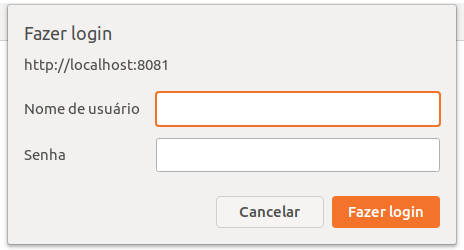
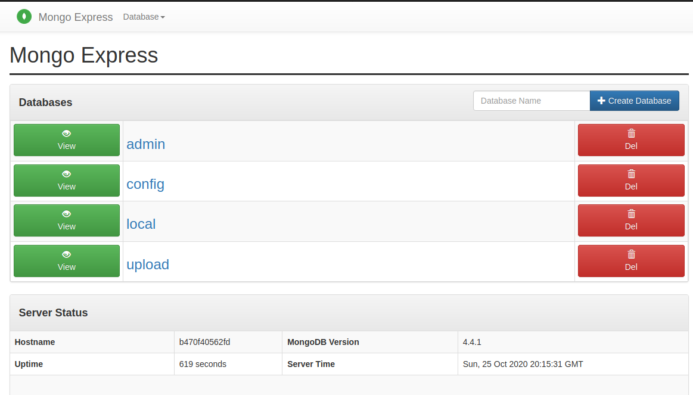

# :whale: MongoDB + mongo-express + Docker Compose

- :mega: Project developed to facilitate the creation of a development environment based on Docker containers with the MongoDB and Mongo-express database (graphical administration interface of MongoDB via Web).

- :mega: Therefore, the objective of this project is to offer a database so that other applications can connect and consume its resources (`insert` - `update` - `select` - `delete`) and a graphical interface to facilitate the visualization of the data, without having to execute command lines in a terminal.

## :pencil: Pre-requisites

`docker-compose  1.23.1+` See how to download and install in [Docker Compose][1]

## :clipboard: Setup

First clone the repository

```sh
$    git clone git@github.com:brunoMiranda8922/mongo-express_app.git
$    cd mongo-express_app
```

Copy env vars:
```sh
$    cp .env.example .env # you can edit if necessary
```

In file docker-compose, change line 26 to:
```yml
volumes:
      - /home/{your_user}/{mongo-express_app}/volumes/mongoDB:/data/db
```
Create a new folder with the following name `volumes/mongoDB` at the root of the project.

```sh
$    mkdir -p volumes/mongoDB
```

## :orange_book: Makefile

Some commands on this project are made using `GNU make`, to know available actions on make, use `make` or `make usage`:

```bash
$    make

$    make usage
```

> Important! Don't forget to see the makefile commands, they will certainly help.

## :mega: Development

start docker:

```sh
$    make start
```

Open [http://localhost:8081](http://localhost:8081) to view the mongo-express interface in the browser and access the database, table and etc.

- When accessing you will have to enter your credentials that you placed in your .env


- You will see something like:


stop docker:

```sh
$    make stop
```

## :computer: Usage

- In your project, make the connection with mongoDB, use the same `username`, `password`, `host`, `port` and `database name` that you are using in your `.env` point to connect to the database. **Ex:**

```js
const express = require('express');
const mongoose = require('mongoose');

const app = express();

mongoose.connect('mongodb://{your_user}:{your_password}@{host}:{port}/{database}?authSource=admin', {
        useUnifiedTopology: true,
        useNewUrlParser: true,
    });

```

## :facepunch: How to contribute

Access the link to know how to [Contribute](./CONTRIBUTING.md)


## :boy: Author


## :red_circle: References

- [Mongo Express][2]
- [Medium by Renato Groffe][3]
- [Docker hub mongo-express][4]

[1]:https://docs.docker.com/compose/install/
[2]:https://github.com/mongo-express/mongo-express
[3]:https://renato-groffe.medium.com/mongodb-mongo-express-docker-compose-montando-rapidamente-um-ambiente-para-uso-824f25ca6957
[4]:https://hub.docker.com/_/mongo-express
